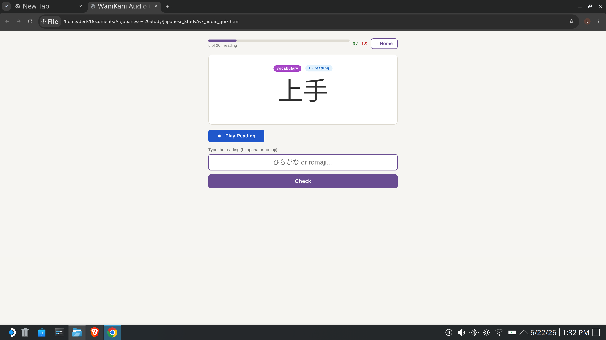

# WaniKani Offline Audio Quiz

A free, offline quiz app that lets you practice WaniKani vocabulary and kanji using the **real human voice recordings** from WaniKani — Kyoko (female) and Kenichi (male). Works on desktop and Android/iPhone with no internet connection required after setup.



**Video demos:**
[Desktop walkthrough](PC_Video.mp4) · [Android in action](Android_Test.MOV)

---

## What it does

- Plays the WaniKani audio for a word and asks you to type the hiragana reading
- Tests English meanings (see the character, type what it means)
- **Both** mode: tests reading *then* meaning for every item in one session
- Covers all 60 WaniKani levels — you choose which levels to quiz
- Tracks your score and shows missed items at the end
- Works completely offline after the one-time setup

---

## Requirements

- A **WaniKani account** (free or paid — see note below)
- **Python 3** installed on your computer
- **Google Chrome** (recommended) or any modern browser

> **Note on WaniKani subscriptions:** The downloader fetches whatever your account has unlocked. A free account gives you levels 1–3. A paid subscription gives you all 60 levels.

---

## Setup (one time only)

### Step 1 — Install Python

If you don't already have Python installed, download it from [python.org](https://www.python.org/downloads/) and run the installer. On Windows, check the box that says **"Add Python to PATH"** during installation.

To check if Python is already installed, open a terminal:
- **Windows:** press `Win + R`, type `cmd`, press Enter
- **Mac:** open the Terminal app (search "Terminal" in Spotlight)

Then type:
```
python --version
```
If you see a version number (e.g. `Python 3.11.2`), you're good.

---

### Step 2 — Download this project

Click the green **Code** button at the top of this page and choose **Download ZIP**. Extract the ZIP somewhere easy to find, like your Desktop or Documents folder. You should have a folder called `Japanese_Study` (or similar) containing these files:

```
download_wk.py
make_mobile.py
wk_audio_quiz.html
README.md
```

---

### Step 3 — Install the requests library

Open a terminal and type:
```
pip install requests
```
(On Mac you may need `pip3 install requests`)

---

### Step 4 — Get your WaniKani API key

1. Log in to [wanikani.com](https://www.wanikani.com)
2. Click your avatar in the top right → **Settings**
3. Go to **Personal Access Tokens**
4. Click **Generate a new token** — you can name it anything, e.g. "Audio Quiz"
5. Copy the token (a long string of letters and numbers)

---

### Step 5 — Download your WaniKani data and audio

Open a terminal and navigate to the project folder. On Windows:
```
cd C:\Users\YourName\Desktop\Japanese_Study
```
On Mac:
```
cd ~/Desktop/Japanese_Study
```

Then run:
```
python download_wk.py
```

You'll be asked to paste your API token. After that, sit back — it downloads all vocabulary, kanji, and audio files. This takes **5–20 minutes** depending on your internet speed. Progress is shown on screen. If it's interrupted for any reason, just run it again — it picks up where it left off.

When finished you'll have:
- `wk_data.js` — all subject data
- `audio/` — thousands of MP3 files (300–500 MB total)

---

### Step 6 — Open the quiz

Open `wk_audio_quiz.html` in Chrome. That's it — you're ready to quiz!

> **Important:** Open the file directly from the folder (File → Open, or drag it into Chrome). Do not move `wk_audio_quiz.html` away from its folder — it needs `wk_data.js` and the `audio/` folder to be next to it.

---

## Using the quiz

On the settings screen you can choose:

- **Levels** — which WaniKani levels to pull items from (e.g. 1 through 10)
- **Item types** — Vocabulary (human voice) and/or Kanji (browser text-to-speech)
- **Test length** — 10, 25, 50, 100, or all items
- **Voice** — Kyoko (female) or Kenichi (male)
- **Quiz type:**
  - **Reading** — hear the audio, type the hiragana
  - **Meaning** — see the character, type the English meaning
  - **Both** — tests reading *then* meaning for each item (double the questions)

During the quiz, press **Enter** to submit your answer, then **Enter** again (or click Next) to move on. You can press the **▶ Play** button at any time to hear the audio again. The **⌂ Home** button in the top right takes you back to settings.

At the end you'll see your score, star rating, and a list of any items you missed.

---

## Getting it on your phone (Android or iPhone)

The standard quiz app loads files from your computer, which browsers on phones don't allow. Instead, use `make_mobile.py` to build a **single self-contained file** with everything baked in — no internet, no server, no extra files needed.

### Build the mobile file

In your terminal (from the project folder):
```
python make_mobile.py
```

You'll be asked which levels to embed audio for. More levels = larger file. Some examples:
- Levels `1-5` ≈ 10–20 MB (fast to build, good for beginners)
- Levels `1-60` ≈ 200–400 MB (everything, works fine on modern phones)

Type a range like `1-10` or `1-60` and press Enter. When it finishes, you'll have `wk_audio_quiz_mobile.html`.

### Copy to your phone

Transfer `wk_audio_quiz_mobile.html` to your phone any way you like:
- Google Drive / iCloud
- AirDrop (iPhone/Mac)
- USB cable
- Email it to yourself

### Open on Android

Open Chrome on your phone, then open the file from your Downloads or Files app. All 60 levels of human voice audio work with no internet connection.

### Open on iPhone

Safari on iPhone doesn't allow local HTML files to play audio. Use **Chrome for iOS** instead — same process as Android.

---

## Troubleshooting

**"Data not found" error when opening the quiz**
Make sure `wk_data.js` is in the same folder as `wk_audio_quiz.html`. Run `download_wk.py` if you haven't yet.

**No audio plays**
- Check your volume
- Make sure you're opening the file in Chrome (not Edge, Firefox, or Safari for the desktop version)
- For kanji items, audio uses your browser's text-to-speech — make sure your OS has a Japanese voice installed

**The download script stopped partway through**
Just run `python download_wk.py` again — it skips files already downloaded.

**Python not found**
On Windows, re-run the Python installer and check "Add Python to PATH". Then close and reopen your terminal.

---

## Files in this repo

| File | What it does |
|---|---|
| `wk_audio_quiz.html` | The quiz app |
| `download_wk.py` | Downloads your WaniKani data and audio files |
| `make_mobile.py` | Builds a self-contained single-file version for phones |

The downloaded data (`wk_data.js` and the `audio/` folder) are **not included** — they contain WaniKani's licensed content and must be generated with your own account.

---

## License

The code in this repository is released under the MIT License. WaniKani content (vocabulary, kanji, audio recordings) is owned by [Tofugu LLC](https://www.tofugu.com/) and subject to their [Terms of Service](https://www.wanikani.com/terms). You must have a valid WaniKani account to use this app.
